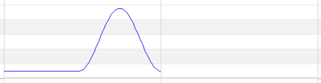

# Mode1 音高曲线

Mode 1 音高曲线 脚本解析

---

## 序言
+ 可能很多人觉得 Mode 1 没用，主要是 UTAU 的 Mode 1 操作流程是在是不太令人满意。（UTAU插件标准也把这个略去了）
+ 但是其实 Mode 2 的音高曲线在传给引擎前，是先转化成 Mode 1 的形式的，因为重采样器只看得懂连续的音高曲线采样点。

### PBStart
+ 音高曲线的起点，其值等于` 先行声音（校正后）+ STP（校正后）`，**再取负**
+ 一般不应手动修改

### PitchBend
+ 以 PBStart 为起点，每 5 ticks 记录一个音高采样点（即一个四分音符 96 个）
+ 采样点为整数，范围 **-2048~2047**
+ 采样点的值为偏离当前音符的音阶的程度，**一个半音相当于 100**
+ 空白相当于 0，如果末尾全是 0，可以省略
  
### PBType
+ 通常都是 5

### 示例
#### 脚本
> + PBType=5
> + PitchBend=0,0,0,0,0,0,0,0,0,0,0,0,0,0,0,0,0,0,0,0,0,0,0,0,0,0,0,0,0,0,0,0,0,0,0,0,0,0,0,0,0,0,0,0,0,0,0,3,9,18,31,46,64,84,106,130,155,181,208,235,261,286,311,334,355,374,390,403,414,421,426,426,424,418,410,398,383,366,346,325,301,277,251,225,199,172,147,122,99,78,58,41,27,16,7,2,0
> + PBStart=0.0
#### 形状

